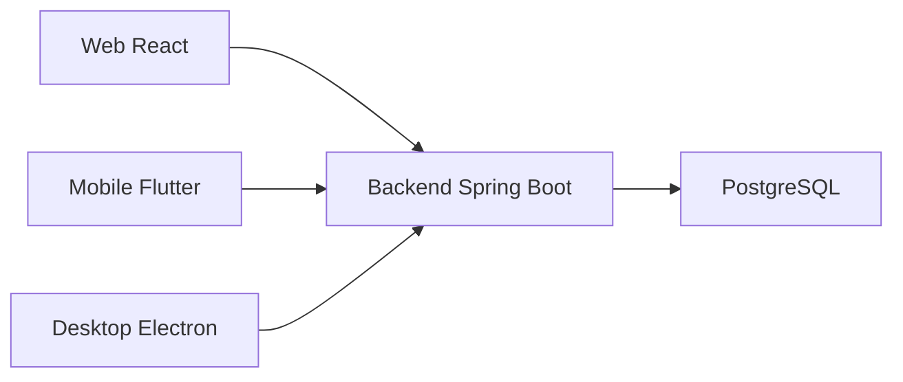

<div align="center">

# CollabResearch

**Plataforma de gerenciamento de TCC composta por backend, web, mobile e desktop administrativo.**

<p>
  
  
  
  
  
</p>

Monorepo com API Spring Boot, interface web React, aplicativo Flutter e painel desktop Electron.

</div>

---

## Visao geral

O **CollabResearch** organiza os modulos principais da plataforma de TCC:

| Modulo | Objetivo | Projeto |
| --- | --- | --- |
| Backend | API, persistencia, autenticacao e regras de negocio | `backend/tcc-backend` |
| Web | Interface React para uso da plataforma no navegador | `web` |
| Mobile | Aplicativo Flutter para acesso mobile | `mobile` |
| Desktop | Painel administrativo em Electron | `desktop` |

## Tecnologias

### Backend

- Java 21
- Spring Boot 4.0.3
- Maven
- Spring Web MVC
- Spring Security
- Spring Data JPA
- Spring Validation
- Spring WebSocket
- PostgreSQL
- H2
- JJWT 0.12.6
- Lombok
- Springdoc OpenAPI 3.0.0
- Docker

### Web

- JavaScript
- React 18.3.1
- Vite 6.3.5
- React Router 7.13.0
- React Hook Form
- Radix UI
- Lucide React
- Framer Motion
- Recharts
- Sonner
- Tailwind CSS
- Playwright

### Mobile

- Flutter
- Dart
- GoRouter
- Provider
- Dio
- flutter_secure_storage
- stomp_dart_client
- google_fonts
- lucide_icons
- cached_network_image
- fl_chart
- flutter_form_builder
- intl
- timeago
- shared_preferences
- flutter_dotenv

### Desktop

- Electron 42.2.0
- React 19.1.0
- React DOM
- React Router DOM 7.6.0
- TypeScript 5.8.3
- Vite 6.3.5
- vite-plugin-electron
- vite-plugin-electron-renderer
- Tailwind CSS
- PostCSS

## Pre-requisitos

- JDK 21 para o backend.
- Maven ou Maven Wrapper para o backend.
- PostgreSQL acessivel pela URL configurada em `DB_URL`.
- Node.js 18.x ou 20.x e npm para o web.
- Node.js e npm para o desktop.
- Flutter SDK com Dart `>=3.3.0 <4.0.0` para o mobile.

## Instalacao

Backend:

```bash
cd backend/tcc-backend
./mvnw clean install
```

Web:

```bash
cd web
npm install
```

Mobile:

```bash
cd mobile
flutter pub get
```

Desktop:

```bash
cd desktop
npm install
```

## Configuracao

### Backend

O arquivo `backend/tcc-backend/src/main/resources/application.properties` importa arquivos `.env` opcionais da pasta do projeto e de diretorios superiores.

| Variavel | Padrao | Uso |
| --- | --- | --- |
| `PORT` | `8080` | Porta HTTP da aplicacao. |
| `DB_URL` | Nao encontrado | URL JDBC do PostgreSQL. |
| `DB_USER` | Nao encontrado | Usuario do banco. |
| `DB_PASSWORD` | Nao encontrado | Senha do banco. |
| `DB_SSL_MODE` | `require` | Modo SSL do datasource. |
| `JPA_DDL_AUTO` | `update` | Estrategia de schema do Hibernate. |
| `JPA_SHOW_SQL` | `false` | Exibicao de SQL no log. |
| `JWT_SECRET` | vazio | Secret usado para JWT. |
| `JWT_EXPIRATION_MS` | `2592000000` | Expiracao do JWT em milissegundos. |
| `ADMIN_BOOTSTRAP_NAME` | vazio | Nome do administrador bootstrap. |
| `ADMIN_BOOTSTRAP_EMAIL` | vazio | E-mail do administrador bootstrap. |
| `ADMIN_BOOTSTRAP_PASSWORD` | vazio | Senha do administrador bootstrap. |
| `CORS_ALLOWED_ORIGIN_PATTERNS` | `http://localhost:*,http://127.0.0.1:*,https://*.vercel.app` | Origens permitidas pelo CORS. |

### Web

O `web/vite.config.js` carrega variaveis com `loadEnv` e configura proxy para `/api` e `/ws`.

| Variavel | Padrao | Uso |
| --- | --- | --- |
| `VITE_API_PROXY_TARGET` | Nao encontrado | URL usada como alvo do proxy de desenvolvimento. |
| `VITE_API_URL` | Nao encontrado | URL alternativa usada para definir o alvo do proxy. |

Quando nenhuma das variaveis acima e informada, o proxy usa `https://tcc-backend-jqod.onrender.com`.

### Mobile

O `mobile/pubspec.yaml` registra `.env` como asset e inclui `flutter_dotenv` nas dependencias. Nenhuma chave especifica foi encontrada nos arquivos permitidos.

### Desktop

| Variavel | Padrao | Uso |
| --- | --- | --- |
| `DESKTOP_API_URL` | `https://tcc-backend-jqod.onrender.com/api` | Base da API usada pelo processo principal Electron. Deve usar HTTPS ou HTTP local e terminar com `/api`. |
| `VITE_DEV_SERVER_URL` | Nao encontrado | URL carregada pelo Electron durante desenvolvimento quando definida pelo Vite/plugin Electron. |

## Execucao

Backend:

```bash
cd backend/tcc-backend
./mvnw spring-boot:run
```

Web:

```bash
cd web
npm run dev
```

Mobile:

```bash
cd mobile
flutter run
```

Desktop:

```bash
cd desktop
npm run dev
```

## Build

Backend:

```bash
cd backend/tcc-backend
./mvnw clean package -DskipTests
```

Docker do backend:

```bash
cd backend/tcc-backend
docker build -t collabresearch-backend .
```

Web:

```bash
cd web
npm run build
```

Mobile:

```bash
cd mobile
flutter build apk
flutter build web
flutter build windows
```

Desktop:

```bash
cd desktop
npm run build
```

## Testes E2E (Playwright)

> **⚠️ Testes E2E só podem ser executados contra backend e banco locais.**
> A suíte bloqueia automaticamente URLs remotas para evitar poluir produção.

Os testes end-to-end do web usam Playwright e estao em `web/e2e/`.

### Estrutura dos testes

```text
web/e2e/
|-- tests/                  # Testes funcionais (login, cadastro, projetos, etc.)
|-- security/               # Testes de seguranca (access-control, headers, JWT, XSS, etc.)
|-- tests-mocked/           # Testes com mocks (API error states, pages, auth)
|-- pages/                  # Page Objects para reutilizacao
|-- factories/              # Dados de teste (project, profile, document, auth)
|-- fixtures/               # Fixtures customizados do Playwright
`-- helpers/                # Helpers de API, auth, assertions, mock, etc.
```

### Como rodar

Prerequisito: instalar as dependencias do web antes (`cd web && npm install`).

Rodar todos os testes E2E funcionais:

```bash
cd web
npm run test:e2e
```

Rodar os testes de seguranca:

```bash
cd web
npm run test:security
```

Rodar apenas o smoke test de seguranca:

```bash
cd web
npm run test:security:smoke
```

### Variaveis de ambiente

| Variavel | Padrao | Uso |
| --- | --- | --- |
| `E2E_PORT` | `5173` | Porta do dev server para os testes funcionais. |
| `E2E_BASE_URL` | `http://127.0.0.1:<E2E_PORT>` | URL base do app nos testes. |
| `VITE_API_URL` | `http://127.0.0.1:8080` | URL da API usada nos testes. |
| `E2E_API_URL` | `http://127.0.0.1:8081` | URL da API para os testes de seguranca. |

## Estrutura do Projeto

```text
tcc/
|-- backend/
|   `-- tcc-backend/
|       |-- src/
|       |-- docs/
|       |-- Dockerfile
|       `-- pom.xml
|-- web/
|   |-- src/
|   |-- e2e/
|   |-- public/
|   |-- package.json
|   `-- vite.config.js
|-- mobile/
|   |-- lib/
|   |-- android/
|   |-- test/
|   |-- web/
|   |-- windows/
|   `-- pubspec.yaml
|-- desktop/
|   |-- electron/
|   |-- src/
|   |-- package.json
|   |-- tsconfig.json
|   |-- tsconfig.node.json
|   `-- vite.config.ts
`-- README.md
```

## Integracoes



- O web usa proxy do Vite para `/api` e `/ws`.
- O mobile possui dependencias para HTTP com `dio` e comunicacao STOMP/WebSocket com `stomp_dart_client`.
- O desktop chama a API por uma ponte IPC (`desktop:api-request`) no processo principal Electron.
- O backend usa PostgreSQL como datasource configurado por variaveis de ambiente.

## Equipe/Autores

Nao encontrado.

## Licenca

Nao encontrado.

## Arquivos consultados

- `backend/tcc-backend/README.md`
- `backend/tcc-backend/pom.xml`
- `backend/tcc-backend/src/main/resources/application.properties`
- `backend/tcc-backend/Dockerfile`
- `web/README.md`
- `web/package.json`
- `web/vite.config.js`
- `web/jsconfig.json`
- `mobile/README.md`
- `mobile/pubspec.yaml`
- `desktop/README.md`
- `desktop/package.json`
- `desktop/electron/main.ts`
- `desktop/electron/preload.ts`
