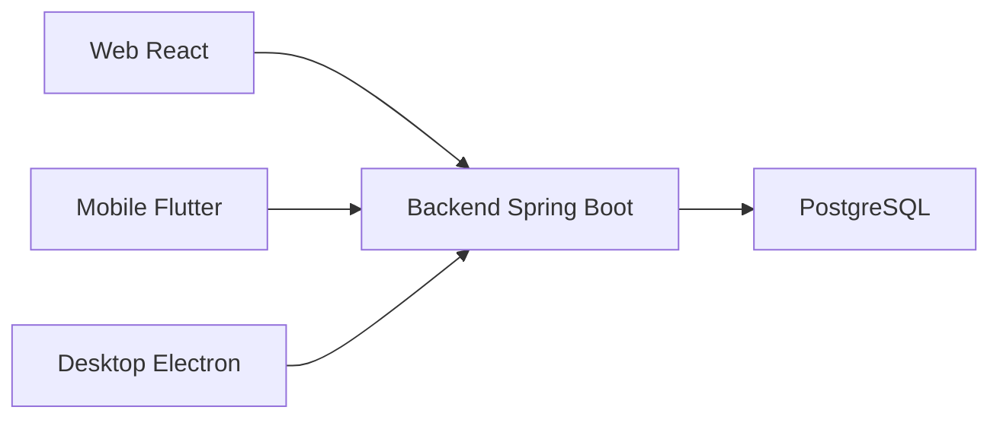

<div align="center">

# CollabResearch

**Plataforma para organizar projetos acadêmicos e de TCC, da publicação e inscrição ao acompanhamento das etapas e da comunicação entre alunos e orientadores.**

<p>
  
  
  
  
  
</p>

<p>
  
  
  
</p>

Monorepo com API Spring Boot, interface web React, aplicativo Flutter e painel desktop Electron. Alunos encontram projetos e acompanham inscrições e prazos; orientadores publicam oportunidades e acompanham participantes; administradores gerenciam cadastros e configurações institucionais.

</div>

---

## Sumário

- [Demonstração](#demonstração)
- [Funcionalidades](#funcionalidades)
- [Tecnologias Utilizadas](#tecnologias-utilizadas)
- [Pré-requisitos](#pré-requisitos)
- [Instalação](#instalação)
- [Como Usar](#como-usar)
- [Estrutura de Pastas](#estrutura-de-pastas)
- [Testes](#testes)
- [Roadmap](#roadmap)
- [Como Contribuir](#como-contribuir)
- [Licença](#licença)
- [Autor/Contato](#autorcontato)

---

## Demonstração

> **Em breve:** screenshots da interface web, aplicativo mobile e painel desktop administrativo.  
> A plataforma contempla quatro frentes: **Web (React)**, **Mobile (Flutter)**, **Desktop Admin (Electron)** e **Backend (Spring Boot)**.

---

## Funcionalidades

### Para Alunos
- **Busca inteligente de projetos** com filtros por área temática, curso, requisitos e palavras-chave
- **Inscrição online** com upload de documentos (currículo, Currículo Lattes, histórico escolar)
- **Cadastro de projetos próprios** e recrutamento de colaboradores
- **Acompanhamento de progresso** do projeto: etapas, entregas, relatórios parciais/finais
- **Comunicação direta** com orientador via chat/notificações integradas

### Para Orientadores
- **Gestão centralizada** de inscrições: visualização, aprovação, recusa com justificativa
- **Acompanhamento de orientandos**: cronograma, entregas, frequência, relatórios
- **Cadastro e edição de projetos** com descrição, requisitos, vagas, cronograma
- **Dashboard analítico** com métricas de participação, conclusão, áreas mais procuradas

### Para Administradores (Painel Desktop)
- **Gestão de usuários** (alunos, orientadores, coordenadores) e permissões por papel
- **Configuração institucional**: editais, calendários, áreas de conhecimento, cursos
- **Relatórios institucionais**: estatísticas de inscrição, aprovação, conclusão por período/curso/área
- **Auditoria e logs** de ações sensíveis (aprovações, exclusões, alterações de edital)

### Transversais
- Autenticação segura (JWT, refresh tokens, expiração configurável)
- WebSocket para notificações em tempo real (novas inscrições, mensagens, atualizações de status)
- Multi-instituição: arquitetura preparada para expansão além da Unicamp
- API documentada (OpenAPI/Swagger) para integrações futuras

---

## Tecnologias Utilizadas

| Camada | Stack Principal |
|--------|-----------------|
| **Backend** | Java 21, Spring Boot 4, Spring Security, Spring Data JPA, Spring WebSocket, PostgreSQL, JJWT, Springdoc OpenAPI |
| **Web (React)** | React 18, Vite, Tailwind CSS, React Router 7, React Hook Form, Radix UI, Framer Motion, Recharts, Playwright (E2E) |
| **Mobile (Flutter)** | Flutter 3.x, Dart, GoRouter, Provider, Dio, flutter_secure_storage, stomp_dart_client, fl_chart |
| **Desktop Admin (Electron)** | Electron 42, React 19, TypeScript, Vite, Tailwind CSS, IPC type-safe (contextBridge) |
| **Infra/DevOps** | Docker, Render (backend), Vercel (web), GitHub Actions (CI/CD planejado) |
| **Banco de Dados** | PostgreSQL (produção), H2 (testes locais) |
| **Versionamento** | Git + GitHub (monorepo) |

---

## Pré-requisitos

| Ferramenta | Versão Mínima | Observação |
|------------|---------------|------------|
| **JDK** | 21 | Para backend |
| **Maven** | 3.9+ | Ou use `./mvnw` wrapper |
| **PostgreSQL** | 15+ | Instância local ou remota |
| **Node.js** | 18.x ou 20.x | Para web e desktop |
| **npm** | 9+ | Incluído no Node.js |
| **Flutter SDK** | 3.3+ (Dart 3.3+) | Para mobile |
| **Docker** | 24+ | Opcional, para containerizar backend |

---

## Instalação

```bash
# 1. Clone o repositório
git clone https://github.com/seu-usuario/CollabResearch.git
cd CollabResearch

# 2. Backend
cd backend/tcc-backend
./mvnw clean install

# 3. Web
cd ../../web
npm install

# 4. Mobile
cd ../mobile
flutter pub get

# 5. Desktop Admin
cd ../desktop
npm install
```

### Variáveis de Ambiente

Crie arquivos `.env` baseados nos exemplos de cada módulo:

**Backend** (`backend/tcc-backend/.env`)
```properties
PORT=8080
DB_URL=jdbc:postgresql://localhost:5432/collabresearch
DB_USER=postgres
DB_PASSWORD=sua_senha
DB_SSL_MODE=disable
JPA_DDL_AUTO=update
JPA_SHOW_SQL=false
JWT_SECRET=gere_um_secret_forte_com_openssl_rand_base64_64
JWT_EXPIRATION_MS=2592000000
ADMIN_BOOTSTRAP_NAME=Admin
ADMIN_BOOTSTRAP_EMAIL=admin@instituicao.edu.br
ADMIN_BOOTSTRAP_PASSWORD=senha_forte_aqui
CORS_ALLOWED_ORIGIN_PATTERNS=http://localhost:*,http://127.0.0.1:*,https://*.vercel.app
```

**Web** (`web/.env`)
```properties
VITE_API_PROXY_TARGET=http://localhost:8080
# ou
VITE_API_URL=http://localhost:8080
```

**Desktop** (`desktop/.env`)
```properties
DESKTOP_API_URL=http://localhost:8080/api
```

**Mobile** (`mobile/.env`)
```properties
API_BASE_URL=http://10.0.2.2:8080/api  # 10.0.2.2 = localhost no emulador Android
```

---

## Como Usar

### Execução Local (Desenvolvimento)

```bash
# Terminal 1 - Backend
cd backend/tcc-backend
./mvnw spring-boot:run
# API em http://localhost:8080
# Swagger UI em http://localhost:8080/swagger-ui.html

# Terminal 2 - Web
cd web
npm run dev
# App em http://localhost:5173 (proxy /api -> backend)

# Terminal 3 - Mobile
cd mobile
flutter run
# Escolha dispositivo: Chrome (web), Android, iOS, Windows

# Terminal 4 - Desktop Admin
cd desktop
npm run dev
# Janela Electron abre automaticamente
```

### Build de Produção

```bash
# Backend (JAR)
cd backend/tcc-backend
./mvnw clean package -DskipTests
# Artefato: target/tcc-backend-*.jar

# Backend (Docker)
docker build -t collabresearch-backend .

# Web (estático)
cd web
npm run build
# Saída: dist/

# Mobile
cd mobile
flutter build apk          # Android
flutter build ios          # iOS (macOS necessário)
flutter build web          # PWA
flutter build windows      # Windows desktop

# Desktop Admin
cd desktop
npm run build
# Artefatos em dist/ (por plataforma)
```

### Endpoints Principais da API

| Método | Rota | Descrição |
|--------|------|-----------|
| `POST` | `/api/auth/login` | Autenticação (retorna JWT) |
| `POST` | `/api/auth/refresh` | Renovar access token |
| `GET` | `/api/projetos` | Listar projetos (filtros: area, curso, q) |
| `POST` | `/api/projetos` | Criar projeto (orientador/admin) |
| `POST` | `/api/inscricoes` | Inscrever-se em projeto (aluno) |
| `PUT` | `/api/inscricoes/{id}/status` | Aprovar/recusar inscrição (orientador) |
| `GET` | `/api/me/projetos` | Projetos do usuário logado |
| `WS` | `/ws` | WebSocket para notificações em tempo real |

> Documentação completa: `http://localhost:8080/swagger-ui.html` (apenas em dev)

---

## Estrutura de Pastas

```text
CollabResearch/
├── backend/
│   └── tcc-backend/
│       ├── src/main/java/...     # Código Spring Boot
│       ├── src/main/resources/   # application.properties, db/migration
│       ├── docs/                 # Documentação técnica (OpenAPI, arquitetura)
│       ├── Dockerfile
│       └── pom.xml
├── web/
│   ├── src/                      # React app (components, pages, hooks, services)
│   ├── e2e/                      # Testes Playwright (funcionais, segurança, mockados)
│   ├── public/
│   ├── package.json
│   └── vite.config.js
├── mobile/
│   ├── lib/                      # Flutter app (features, core, shared)
│   ├── android/                  # Config Android nativo
│   ├── ios/                      # Config iOS nativo
│   ├── web/                      # Build web/PWA
│   ├── windows/                  # Build Windows desktop
│   ├── test/                     # Testes unitários/widget
│   └── pubspec.yaml
├── desktop/
│   ├── electron/                 # Processo principal (main.ts, preload.ts, IPC)
│   ├── src/                      # Renderer React (admin dashboard)
│   ├── package.json
│   ├── tsconfig.json
│   └── vite.config.ts
├── .github/workflows/            # CI/CD (planejado)
├── AGENTS.md                     # Instruções para agentes de IA
└── README.md                     # Este arquivo
```

---

## Testes

### Backend
```bash
cd backend/tcc-backend
./mvnw test                    # Testes unitários + integração
./mvnw verify                  # Inclui testes de integração com Testcontainers
```

### Web (Playwright E2E)
```bash
cd web

# Pré-requisito: backend e banco locais rodando
# A suíte BLOQUEIA URLs remotas automaticamente

npm run test:e2e               # Testes funcionais completos
npm run test:security          # Testes de segurança (headers, JWT, XSS, access-control)
npm run test:security:smoke    # Smoke test de segurança
npm run test:e2e:headed        # Com browser visível (debug)
npm run test:e2e:ui            # Playwright UI mode
```

> Variáveis de ambiente para testes: `E2E_PORT=5173`, `VITE_API_URL=http://127.0.0.1:8080`, `E2E_API_URL=http://127.0.0.1:8081`

### Mobile
```bash
cd mobile
flutter test                   # Testes unitários e widget
flutter test integration_test/ # Testes de integração (device/emulator)
```

### Desktop
```bash
cd desktop
npm run test                   # Testes unitários (Vitest/Jest)
npm run test:e2e               # Playwright contra build do Electron (planejado)
```

---

## Roadmap

### v0.2.0 — MVP Funcional (Próximo)
- [ ] CRUD completo de projetos e inscrições
- [ ] Autenticação JWT + refresh tokens + logout seguro
- [ ] Upload de documentos (currículo, Lattes) com validação
- [ ] Notificações WebSocket (inscrição, status, mensagens)
- [ ] Dashboard aluno/orientador com listagens e filtros

### v0.3.0 — Experiência do Usuário
- [ ] Busca avançada com autocomplete e sugestões
- [ ] Perfil público do orientador (projetos orientados, áreas)
- [ ] Chat aluno-orientador integrado
- [ ] Relatórios de progresso (parcial/final) com versionamento
- [ ] PWA (service worker, offline-first para leitura)

### v0.4.0 — Administração e Multi-instituição
- [ ] Painel desktop: gestão de usuários, editais, áreas, cursos
- [ ] Relatórios institucionais exportáveis (CSV/PDF)
- [ ] Multi-tenancy: suporte a múltiplas instituições no mesmo deploy
- [ ] Auditoria completa (logs imutáveis de ações sensíveis)

### v1.0.0 — Produção
- [ ] Testes de carga e performance (k6/Gatling)
- [ ] Hardening de segurança (pentest, OWASP Top 10)
- [ ] Documentação de API pública (OpenAPI 3.1)
- [ ] Deploy automatizado (GitHub Actions → Render/Vercel)
- [ ] Monitoramento (Sentry, Prometheus/Grafana, health checks)

---

## Como Contribuir

1. **Faça um fork** do repositório
2. **Crie uma branch** descritiva: `git checkout -b feat/busca-avancada` ou `fix/validacao-cpf`
3. **Siga os padrões** do módulo afetado:
   - Backend: Google Java Format + Checkstyle (ver `pom.xml`)
   - Web: ESLint + Prettier (`npm run lint && npm run format`)
   - Mobile: `flutter analyze && dart format --set-exit-if-changed .`
   - Desktop: `npm run lint && npm run format`
4. **Escreva testes** para nova funcionalidade (cobertura alvo > 80%)
5. **Commit convencional**: `feat: adiciona filtro por área na busca de projetos`
6. **Abra um Pull Request** com descrição clara do que muda e por quê
7. **Aguarde review** — pelo menos 1 aprovação necessária

> Guia detalhado: [CONTRIBUTING.md](CONTRIBUTING.md) (a ser criado)

---

## Integrações


```mermaid
flowchart LR
    A["Web React"] --> D["Backend Spring Boot"]
    B["Mobile Flutter"] --> D
    C["Desktop Electron"] --> D
    D --> E["PostgreSQL"]
```

- O web usa proxy do Vite para `/api` e `/ws`.
- O mobile possui dependências para HTTP com `dio` e comunicação STOMP/WebSocket com `stomp_dart_client`.
- O desktop chama a API por uma ponte IPC (`desktop:api-request`) no processo principal Electron.
- O backend usa PostgreSQL como datasource configurado por variáveis de ambiente.

---

## Licença

Este projeto está licenciado sob a **Licença MIT** — veja o arquivo [LICENSE](LICENSE) para detalhes.

---

> **Referências**  
> - CNPq — Programa Institucional de Bolsas de Iniciação Científica (PIBIC): <https://www.cnpq.br>  
> - UNICAMP — Pró-Reitoria de Pesquisa: <https://prp.unicamp.br>
