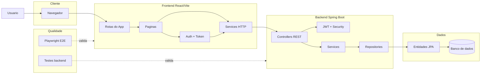

# Template de Arquitetura para Banner

Use este arquivo como modelo de entrega quando o agente principal terminar a leitura do codigo.

## Titulo

Arquitetura do Sistema de Gerenciamento de TCC

## Resumo curto

Sistema web com frontend React/Vite, backend Spring Boot e persistencia via camada de repositories. A comunicacao ocorre por API REST, com autenticacao por token JWT e validacoes automatizadas por testes de frontend e backend.

> Ajuste o resumo somente com informacoes confirmadas no codigo.

## Tecnologias confirmadas

| Camada | Tecnologias | Evidencias |
|---|---|---|
| Frontend | React, Vite, React Router | `../Front-end-tcc/package.json`, `../Front-end-tcc/src/app/routes.jsx` |
| Integracao | Fetch/API services, Bearer token | `../Front-end-tcc/src/app/services/api.js` |
| Backend | Spring Boot, REST Controllers | `../tcc-backend/tcc-backend/pom.xml`, `src/main/java/.../controller` |
| Seguranca | JWT, Spring Security, CORS | `src/main/java/.../security`, `src/main/java/.../config` |
| Dados | JPA Repositories, entidades | `src/main/java/.../repository`, `src/main/java/.../model` |
| Testes | Playwright, testes backend | `../Front-end-tcc/e2e`, `../tcc-backend/tcc-backend/src/test` |

## Diagrama Mermaid para banner

Salve o conteudo abaixo como `arquitetura-sistema.mmd` depois de confirmar os nomes no codigo.



## Explicacao do fluxo

1. O usuario acessa o sistema pelo navegador.
2. O frontend React/Vite organiza rotas, paginas, autenticacao e chamadas HTTP.
3. Os services enviam requisicoes para a API Spring Boot.
4. O backend recebe chamadas nos controllers, aplica seguranca JWT e executa regras nos services.
5. A persistencia passa por repositories e entidades JPA ate o banco de dados.
6. Testes E2E e testes backend validam os fluxos principais.

## Checklist visual para banner

- O titulo aparece acima do diagrama.
- O fluxo principal fica da esquerda para a direita.
- O diagrama tem no maximo 5 grupos visuais.
- Cada bloco tem texto curto.
- Testes aparecem como validacao, nao como fluxo principal.
- O arquivo final foi exportado em SVG ou PNG em alta resolucao.

## Comandos de exportacao

```bash
mmdc -i arquitetura/arquitetura-sistema.mmd -o arquitetura/arquitetura-sistema.svg -b transparent
mmdc -i arquitetura/arquitetura-sistema.mmd -o arquitetura/arquitetura-sistema.png -b transparent -s 3
```

## Limitacoes

Registre aqui qualquer item nao confirmado, por exemplo:

- banco de dados nao identificado no projeto;
- variaveis de ambiente ausentes;
- endpoint encontrado, mas fluxo de tela nao confirmado;
- comando de exportacao nao executado nesta maquina.
