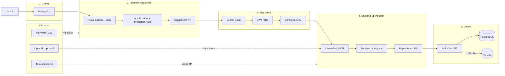

# Arquitetura do Sistema de Gerenciamento de TCC

## Resumo

O projeto e um sistema web com frontend React/Vite e backend Spring Boot. O frontend organiza rotas publicas e uma area autenticada em `/app`, usa providers para tema/autenticacao e centraliza chamadas HTTP em services. O backend expoe uma API REST em camadas, com Spring Security/JWT, services de negocio, repositories JPA e persistencia principal em PostgreSQL.

## Imagem para banner

Arquivo gerado:

```txt
arquitetura/arquitetura-sistema.svg
```

Arquivo editavel em Mermaid:

```txt
arquitetura/arquitetura-sistema.mmd
```

## Tecnologias confirmadas

| Camada | Tecnologias | Evidencias |
|---|---|---|
| Frontend | React 18, Vite 6, React Router 7 | `../Front-end-tcc/package.json`, `../Front-end-tcc/vite.config.js`, `../Front-end-tcc/src/app/routes.jsx` |
| UI | Tailwind 4, Radix UI, lucide-react, framer-motion, sonner, recharts | `../Front-end-tcc/package.json` |
| Integracao | Fetch centralizado, `VITE_API_URL`, Bearer token | `../Front-end-tcc/src/app/services/api.js` |
| Backend | Java 21, Spring Boot 4.0.3, Spring WebMVC | `../tcc-backend/tcc-backend/pom.xml`, `../tcc-backend/tcc-backend/src/main/java/com/example/tcc_backend/TccBackendApplication.java` |
| Seguranca | Spring Security stateless, JWT, CORS | `../tcc-backend/tcc-backend/src/main/java/com/example/tcc_backend/security/SecurityConfig.java`, `../tcc-backend/tcc-backend/src/main/java/com/example/tcc_backend/security/JwtAuthFilter.java`, `../tcc-backend/tcc-backend/src/main/java/com/example/tcc_backend/config/CorsConfig.java` |
| Dados | Spring Data JPA, PostgreSQL, H2 para E2E | `../tcc-backend/tcc-backend/src/main/resources/application.properties`, `../tcc-backend/tcc-backend/src/main/resources/application-e2e.properties` |
| Qualidade | Playwright E2E, testes de service/controller backend | `../Front-end-tcc/e2e`, `../tcc-backend/tcc-backend/src/test/java/com/example/tcc_backend` |

## Fluxo principal organizado

1. O usuario acessa o sistema no navegador.
2. O React/Vite organiza as rotas publicas e a area protegida `/app`.
3. A autenticacao fica concentrada em `AuthProvider`, `ProtectedRoute` e token JWT.
4. Os services HTTP enviam chamadas REST com `Authorization: Bearer`.
5. O backend valida o token no filtro JWT e no Spring Security.
6. Controllers chamam services de negocio, que usam repositories JPA.
7. As entidades JPA persistem no PostgreSQL; o H2 aparece no perfil E2E.
8. Playwright valida a interface e os testes backend validam services/controllers.

## Recursos principais da API

| Recurso | Rota base | Controller |
|---|---|---|
| Autenticacao | `/api/auth` | `AuthController` |
| Usuarios | `/api/usuarios` | `UsuarioController` |
| Projetos | `/api/projetos` | `ProjetoController` |
| Inscricoes | `/api/inscricoes` | `InscricaoController` |
| Progresso | `/api/projetos/{id}/progresso`, `/api/progresso/{id}` | `ProgressoController` |
| Documentos | `/api/documentos` | `DocumentoController` |
| Conversas | `/api/conversas` | `ConversaController` |
| Feedback | `/api/feedback` | `FeedbackController` |
| Notificacoes | `/api/notificacoes` | `NotificacaoController` |
| Dashboard | `/api/dashboard` | `DashboardController` |
| Catalogos | `/api/cursos`, `/api/areas` | `CursoController`, `AreaPesquisaController` |

## Mermaid



## Limitacoes

- A imagem foi gerada como SVG estatico para facilitar uso em banner.
- Nao foram executados testes/builds, porque a tarefa foi de leitura e documentacao de arquitetura.
- Segredos reais nao foram expostos; a documentacao cita apenas nomes de variaveis e configuracoes confirmadas.
