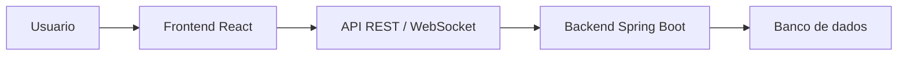

<div align="center">

# CollabResearch Frontend

**Interface web do sistema de gerenciamento de TCC.**

<p>
  
  
  
</p>

</div>

---

## Visao geral

Aplicacao web responsiva para alunos, orientadores e administradores acompanharem projetos, inscricoes, documentos, chat e notificacoes.

## Objetivo

Centralizar o fluxo academico de TCC em uma interface unica, reduzindo controles manuais e facilitando a interacao entre aluno e orientador.

## Funcionalidades principais

- Login e cadastro de usuarios.
- Dashboard com resumo do perfil e atividades.
- Listagem e detalhamento de projetos.
- Inscricao em projetos e acompanhamento do status.
- Perfil do usuario com edicao de dados e documentos.
- Chat, notificacoes e progresso do projeto.

## Tecnologias utilizadas

- React 18
- Vite
- JavaScript
- React Router
- React Hook Form
- Radix UI
- Lucide React
- Framer Motion
- Recharts
- Sonner
- Playwright
- Tailwind CSS

## Estrutura do projeto

```text
Front-end-tcc/
|-- src/app/
|   |-- pages/        # Telas da aplicacao
|   |-- components/   # Componentes reutilizaveis
|   |-- services/     # Chamadas HTTP para a API
|   |-- providers/    # Contextos globais
|   |-- hooks/        # Hooks customizados
|   |-- utils/        # Adaptadores e formatadores
|   `-- layouts/      # Layout principal
|-- e2e/              # Testes end-to-end
|-- public/           # Arquivos estaticos
|-- vite.config.js    # Configuracao do Vite
`-- package.json      # Scripts e dependencias
```

## Pre-requisitos

- Node.js 18 ou 20
- npm
- Backend CollabResearch em execucao

## Configuracao de ambiente

O projeto le variaveis via Vite. Crie um `.env.local` na raiz do frontend quando precisar apontar para outra API:

```env
VITE_API_URL=http://localhost:8080
VITE_API_PROXY_TARGET=http://localhost:8080
```

`VITE_API_URL` define a base da API. `VITE_API_PROXY_TARGET` e usado no desenvolvimento local para proxy de `/api` e `/ws`.

## Instalacao

```bash
npm install
```

## Como executar localmente

```bash
npm run dev
```

## Como gerar build

```bash
npm run build
```

Para visualizar o build localmente:

```bash
npm run preview
```

## Validacao

```bash
npm run test:e2e
```

## Arquitetura resumida



O frontend consome a API do backend por HTTP e usa proxy no Vite durante o desenvolvimento. Fluxos em tempo real, como chat, usam a rota WebSocket exposta pelo backend.

## Equipe do projeto

Nao informada nos arquivos do repositorio.

## Licenca

Nao ha arquivo de licenca no repositorio.
